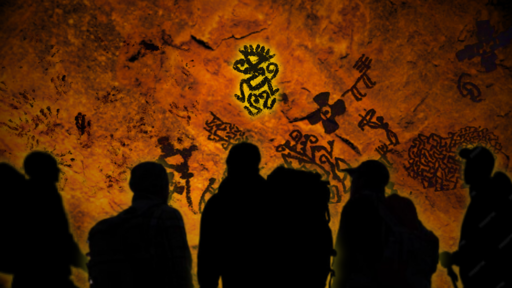

 
# **DEAR OUTSIDER**  
#### *A Descent Into the Deer Cave*

<!-- Replace the link below with your real image -->

A **Discovering Game Experience** created for the **DHDK** course <a href="https://www.unibo.it/en/study/course-units-transferable-skills-moocs/course-unit-catalogue?codiceMateria=B5059&annoAccademico=2024&codiceCorso=9224&single=True&search=True" target="_blank">**Digital Heritage and Multimedia (2024/2025)**</a> taught by Professors <a href="https://www.unibo.it/sitoweb/chiara.tartarini">**Chiara Tartarini**</a> and <a href="https://www.unibo.it/sitoweb/sofia.pescarin/">**Sofia Pescarin**</a>.

---

## 🎮 **About the Experience**

**Dear Outsider** is an atmospheric, narrative-driven game experience set inside the mysterious **Deer Cave** in Otranto, Italy.  
Players descend through ancient passages, uncovering traces of forgotten civilizations, glowing minerals, and echoes from the past.

Designed as an immersive *visually-driven journey*, the project blends:

🏞️ environmental storytelling | 
🔦 light-based navigation |  
🔍 artifact discovery | 
🎨 prehistoric aesthetic  

---

## 🕹️ **Features**

 🔥  Dynamic cave-light effects and flickering ambience |
 🪨  Prehistoric-inspired UI and typography |
 🗺️  Multi-section narrative progression |
 🎥  In-game videos created for key areas |
 🧩  Twine-powered interactive storytelling paths |
 🖌️  Figma UI prototypes and concept art 

---

## 🚀 **Play the Experience**

Enjoy the narration here 👉**<a href="https://imd-rewind.github.io/DearOutsider/DearOutsiderStory.html">Twine</a>**.
 
Enjoy the game UI here 👉**<a href="https://www.figma.com/proto/5uYv1VuZP5wqdA3bpMPLK4/Dear-Outsider-Prototype?node-id=213-92&p=f&t=IzIcI751wPWAY1t8-1&scaling=scale-down&content-scaling=fixed&page-id=0%3A1&starting-point-node-id=213%3A92">Figma</a>**.

---

## 🛠️ **Built With**

HTML5 / CSS3 / JavaScript |
Bootstrap 5 |
Custom animations (glow, flicker, embers) |
Twine |
Figma

---
<!--
## 🎬 **Screenshots & Media**

> *(Add your real images here)*

  
  -->

---

## 👥 **Team REWIND**

<a href="https://github.com/Fahmyrose/">Fahmida Islam </a>  |
<a href="https://github.com/maridematteis">Maria De Matteis</a>  |
<a href="https://github.com/martinamrc">Martina Marchesi</a>

---

## 📜 **Design Philosophy**

> *“A cave is not an empty space: it is a vessel for memory.”*  
Our approach was to merge **archaeological aesthetics** with **modern interaction**, creating a digital descent that feels ancient, eerie, and alive.

---

## 📘 **Design Brief**

Read the complete design document 👉<a href="design_brief.html" target="_blank">**here**</a>!

---

## 📄 License

MIT License © 2025 Team REWIND

---

✨ Thank you for exploring **Dear Friend** ✨  
**Keep Descending.**

